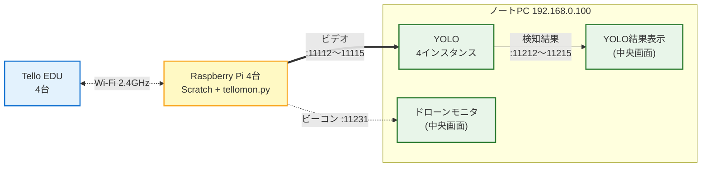

# kids-drone-system

子供向けの体験イベント **「おもしろ体験でぇ～」**（2026/7/24-25 開催）の出展システム。

子供が Scratch で Tello ドローンを操作し、ドローンの空撮映像を YOLO で犬猫検知 → 中央モニタに位置と検知結果をリアルタイム表示する。

## システム構成



- **同時稼働 4 台**（Tello EDU / Raspberry Pi 各4台）＋ 中央ノートPC 1台（192.168.0.100、YOLO 推論・YOLO 結果表示・ドローンモニタを兼ねる）
- 操作 UI は Scratch のみ（子供が触る唯一の UI）
- 中央モニタは「全機俯瞰」用、個別 UI は作らない

## ディレクトリ構成

| ディレクトリ | 役割 |
|---|---|
| `pi/tellomon/` | Pi 側の Tello 制御プログラム（映像転送・ビーコン送信・HTTP API）|
| `yolo_pc/yolo_proc/` | 中央ノートPC 上の YOLO 推論プロセス（YOLOv8）|
| `operator_pc/drone_monitor/` | 中央ノートPC のドローンモニタ |
| `operator_pc/yolo_display/` | 中央ノートPC の YOLO 結果表示 |
| `shared/` | ポート番号・JSON フォーマット等の共通定義 |
| `Scratch/` | 子供向け UI（LLK 公式 clone + drone 拡張 / **git 管理外**）|
| `docs/` | 開発フロー・セットアップ・検証メモ（`development.md` / `raspi-setup.md` / `network-setup.md` ほか）。設計書・計画書・PDF・図はリポジトリ管理外（手元 / Drive 等で管理）|

> `Scratch/` は LLK 公式リポジトリの clone のため `.gitignore` で除外しています。drone 拡張の改造は消失リスク回避のため **`okadai-dsc` に fork 済み**（`okadai-dsc/scratch-vm`・`okadai-dsc/scratch-gui` の `drone` ブランチ）。セットアップ手順は [docs/development.md](docs/development.md) を参照。submodule 化は必要が出たら別 issue で対応します。

## ドキュメント

設計書（正本）・計画書・仕様詳細ドラフト・PDF・図は **リポジトリ管理外**（手元 / Drive 等で管理）。ポート・IP の正本はコード側の [shared/ports.py](shared/ports.py)。

やりたいことから読む文書を選ぶ：

| やりたいこと | 読むもの |
|---|---|
| 開発に参加する（uv 環境・ブランチ運用・Scratch ビルド）| [docs/development.md](docs/development.md) |
| Raspberry Pi を1台構築する（Buster 標準ルート）| [docs/raspi-setup.md](docs/raspi-setup.md) |
| 中央ノートPC（YOLO PC）を構築する | [docs/yolopc-setup.md](docs/yolopc-setup.md) |
| ネットワークの考え方・疎通確認を知る | [docs/network-setup.md](docs/network-setup.md) |
| 1台 E2E デモを再現する（リハ構成）| [docs/demo.md](docs/demo.md) |
| 過去の検証記録・ハマりどころを知る | [docs/e2e-1drone.md](docs/e2e-1drone.md) |

## 体制

経験者 1名 + 初心者 1名の2名チーム。担当分けは開発計画（リポジトリ管理外）参照。

## 起動方法

初回セットアップは [Raspberry Pi](docs/raspi-setup.md) / [YOLO PC](docs/yolopc-setup.md) を参照。ここでは毎回の起動コマンドだけをまとめる。動かす号機ぶんだけ番号（`--drone N` / IP 末尾 `.1N`）を変えて繰り返す。

### Raspberry Pi（号機ごと）

`N` は号機番号（1〜4）。eth0 の固定IPは号機に対応（#1→`.11` / #2→`.12` / #3→`.13` / #4→`.14`）。

```bash
# ① eth0 が号機の固定IP（例: 号機2 → 192.168.0.12）か確認
ip addr show eth0        # "inet 192.168.0.12/24" が出ていれば OK

# ①-a 出ていなければ dhcpcd.conf に追記して固定（初回のみ。.12 は号機に合わせる）
#   interface eth0
#   static ip_address=192.168.0.12/24
sudo nano /etc/dhcpcd.conf
sudo systemctl restart dhcpcd

# ② Tello の電源を入れ、Pi の Wi-Fi を担当機の AP（TELLO-XXXXXX）に接続

# ③ tellomon（リポジトリのルートから。--drone は号機番号）
cd ~/kids-drone-system
python3 -m pi.tellomon --drone 2

# ④ Scratch GUI 配信（別ターミナルで）
cd ~/kids-drone-system/build && python3 -m http.server 8601
```

ブラウザで `http://localhost:8601/` を開き、Scratch で「つなぐ」→「streamon」。

### YOLO PC（中央ノートPC / Windows ネイティブ）

リポジトリのルートで、ターミナルを分けて起動する。

```powershell
cd kids-drone-system

# YOLO 推論 ×4（号機ごとに1プロセス）
uv run python yolo/yolo_proc.py --drone 1 --rate 5
uv run python yolo/yolo_proc.py --drone 2 --rate 5
uv run python yolo/yolo_proc.py --drone 3 --rate 5
uv run python yolo/yolo_proc.py --drone 4 --rate 5

# 統合モニタ（検知タイル＋飛行マップ＋全機緊急停止 を1画面）
uv run python -m operator_pc.integrated_ui
```

## 進め方

GitHub の **Milestone (M1〜M4)** と **Issue (C1〜C7)** で管理。

| Milestone | 期日 | 内容 |
|---|---|---|
| M1: 個別コンポーネント骨組み完了 | 2026-06-12 | 各コンポーネントがダミー入出力で単体起動 |
| M2: 1台 E2E 実飛行デモ（中間レビュー）| 2026-06-19 | Scratch → 実飛行 → YOLO 検知 → 中央UI 表示 |
| M3: 2台同時 E2E | 2026-06-26 | 手元 Tello 2台で同時通り抜け |
| M4: 月末まとめ | 2026-06-30 | 残課題整理、7月評価準備 |

ラベル：`area:tellomon` / `area:yolo_proc` / `area:drone_monitor` / `area:yolo_display` / `area:scratch` / `area:shared`、`role:A` / `role:B`

## 開発フロー

セットアップ手順・ブランチ運用・コーディングスタイルは [docs/development.md](docs/development.md) を参照してください。

## ライセンス

[MIT](LICENSE)
