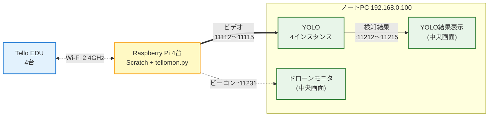

# kids-drone-system

子供向けの体験イベント **「おもしろ体験でぇ～」**（2026/7/24-25 開催）の出展システム。

子供が Scratch で Tello ドローンを操作し、ドローンの空撮映像を YOLO で犬猫検知 → 中央モニタに位置と検知結果をリアルタイム表示する。

## システム構成



- **同時稼働 4 台**（Tello EDU / Raspberry Pi 各4台）＋ 中央ノートPC 1台（192.168.0.100、YOLO 推論・YOLO 結果表示・ドローンモニタを兼ねる）
- 操作 UI は Scratch のみ（子供が触る唯一の UI）
- 中央モニタは「全機俯瞰」用、個別 UI は作らない

## ディレクトリ構成

| ディレクトリ | 役割 |
|---|---|
| `pi/tellomon/` | Pi 側の Tello 制御プログラム（映像転送・ビーコン送信・HTTP API）|
| `yolo_pc/yolo_proc/` | 中央ノートPC 上の YOLO 推論プロセス（YOLOv8）|
| `operator_pc/drone_monitor/` | 中央ノートPC のドローンモニタ |
| `operator_pc/yolo_display/` | 中央ノートPC の YOLO 結果表示 |
| `shared/` | ポート番号・JSON フォーマット等の共通定義 |
| `Scratch/` | 子供向け UI（LLK 公式 clone + drone 拡張 / **git 管理外**）|
| `docs/` | 開発フロー（`development.md`）のみ。設計書・計画書・PDF・図はリポジトリ管理外（手元 / Drive 等で管理）|

> `Scratch/` は LLK 公式リポジトリの clone のため `.gitignore` で除外しています。drone 拡張の改造は消失リスク回避のため **`okadai-dsc` に fork 済み**（`okadai-dsc/scratch-vm`・`okadai-dsc/scratch-gui` の `drone` ブランチ）。セットアップ手順は [docs/development.md](docs/development.md) を参照。submodule 化は必要が出たら別 issue で対応します。

## ドキュメント

設計書（正本）・計画書・ポート定義・仕様詳細ドラフト・PDF・図は **リポジトリ管理外**（手元 / Drive 等で管理）。リポジトリに含むのは開発フロー [docs/development.md](docs/development.md) のみ。

## 体制

経験者 1名 + 初心者 1名の2名チーム。担当分けは開発計画（リポジトリ管理外）参照。

## 起動例

YOLO 結果表示:

```bash
uv sync
uv run python yolo_display.py
```

`fake_detection.json` の読み込み、または UDP `11212〜11215` の `YoloResult` 受信で
Tello#1〜#4 の bbox 画像が 4 区画に表示されます。
検知時は各画像区画の小さな状態ラベルと枠が 3 秒間緑に変わります。

## 進め方

GitHub の **Milestone (M1〜M4)** と **Issue (C1〜C7)** で管理。

| Milestone | 期日 | 内容 |
|---|---|---|
| M1: 個別コンポーネント骨組み完了 | 2026-06-12 | 各コンポーネントがダミー入出力で単体起動 |
| M2: 1台 E2E 実飛行デモ（中間レビュー）| 2026-06-19 | Scratch → 実飛行 → YOLO 検知 → 中央UI 表示 |
| M3: 2台同時 E2E | 2026-06-26 | 手元 Tello 2台で同時通り抜け |
| M4: 月末まとめ | 2026-06-30 | 残課題整理、7月評価準備 |

ラベル：`area:tellomon` / `area:yolo_proc` / `area:drone_monitor` / `area:yolo_display` / `area:scratch` / `area:shared`、`role:A` / `role:B`

## 開発フロー

セットアップ手順・ブランチ運用・コーディングスタイルは [docs/development.md](docs/development.md) を参照してください。

## ライセンス

[MIT](LICENSE)
