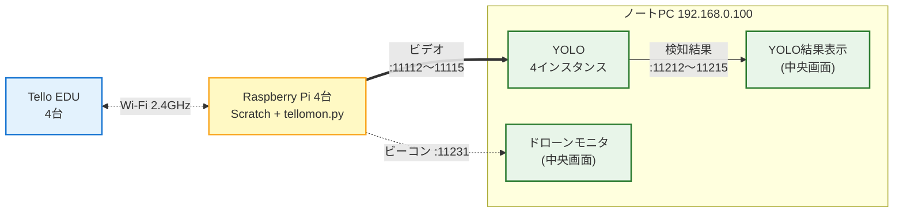

# kids-drone-system

子供向け体験イベント **「おもしろ体験でぇ～」**（2026/7/24-25 開催）の出展システム。

子供が Scratch で Tello ドローンを操作し、ドローンの空撮映像を YOLO で犬猫検知 → 中央モニタに位置と検知結果をリアルタイム表示する。

## システム構成



- **同時稼働 4 台**（Tello EDU / Raspberry Pi 各4台、YOLO PC 1台、中央ノートPC 1台）
- 操作 UI は Scratch のみ（子供が触る唯一の UI）
- 中央モニタは「全機俯瞰」用、個別 UI は作らない

詳細は [docs/figures/system-arch.mmd](docs/figures/system-arch.mmd) と運用配置図 [docs/figures/operation-layout.mmd](docs/figures/operation-layout.mmd) 参照。

## ディレクトリ構成

| ディレクトリ | 役割 |
|---|---|
| `pi/tellomon/` | Pi 側の Tello 制御プログラム（映像転送・ビーコン送信・HTTP API）|
| `yolo_pc/yolo_proc/` | YOLO PC 側の推論プロセス（YOLOv8）|
| `operator_pc/drone_monitor/` | 中央ノートPC のドローンモニタ |
| `operator_pc/yolo_display/` | 中央ノートPC の YOLO 結果表示 |
| `shared/` | ポート番号・JSON フォーマット等の共通定義 |
| `Scratch/` | 子供向け UI（LLK 公式 clone + drone 拡張 / **git 管理外**）|
| `docs/` | 設計書・計画書 |

> `Scratch/` は LLK 公式リポジトリの clone のため `.gitignore` で除外しています。改修要否は 6/30 時点で判断し、必要なら部 org に fork して submodule 化します。

## ドキュメント

| ファイル | 内容 |
|---|---|
| [docs/出展システム説明書.pdf](docs/出展システム説明書.pdf) | 武田氏発の設計書（正本）|
| [docs/おもしろ体験でぇー.pdf](docs/おもしろ体験でぇー.pdf) | イベント説明資料 |
| [docs/スケジュール等に関して.pdf](docs/スケジュール等に関して.pdf) | スケジュール資料 |
| [docs/発注者確認依頼書.pdf](docs/発注者確認依頼書.pdf) | 開発側→武田氏への確認事項（全項目合意済み）|
| [docs/開発者補足/仕様詳細ドラフト.md](docs/開発者補足/仕様詳細ドラフト.md) | JSON フィールド・配色・体験フローの実装ガイド |
| [docs/開発者補足/ポート一覧.md](docs/開発者補足/ポート一覧.md) | 全 UDP/HTTP ポート定義と IP 割当 |
| [docs/開発者補足/開発計画.md](docs/開発者補足/開発計画.md) | 6月末までの WBS・担当分担・マイルストーン |

## 体制

経験者 1名 + 初心者 1名の2名チーム。担当分けは [開発計画.md §3](docs/開発者補足/開発計画.md) 参照。

## 進め方

GitHub の **Milestone (M1〜M4)** と **Issue (C1〜C7)** で管理。

| Milestone | 期日 | 内容 |
|---|---|---|
| M1: 個別コンポーネント骨組み完了 | 2026-06-12 | 各コンポーネントがダミー入出力で単体起動 |
| M2: 1台 E2E 実飛行デモ（中間レビュー）| 2026-06-19 | Scratch → 実飛行 → YOLO 検知 → 中央UI 表示 |
| M3: 2台同時 E2E | 2026-06-26 | 手元 Tello 2台で同時通り抜け |
| M4: 月末まとめ | 2026-06-30 | 残課題整理、7月評価準備 |

ラベル：`area:tellomon` / `area:yolo_proc` / `area:drone_monitor` / `area:yolo_display` / `area:scratch` / `area:shared`、`role:A` / `role:B`

## ローカル開発

```bash
# 1. clone
git clone https://github.com/okadai-dsc/kids-drone-system.git
cd kids-drone-system

# 2. Python 環境（Python 3.12 + uv workspace）
uv sync

# 3. pre-commit のインストール（初回のみ）
uv run pre-commit install

# 4. lint / format（保存時自動整形を推奨）
uv run ruff check .
uv run ruff format .
```

- パッケージ管理は **uv** に統一。`pip` や `requirements.txt` は使わない
- スタイルは **Ruff**（設定は [pyproject.toml](pyproject.toml)）。エディタの保存時自動整形を有効にすると楽
- **pre-commit**：`git commit` するたびに自動で Ruff（lint + format）が走り、整形が必要なら止まる。慌てずに再 add → 再 commit
- **CI**：PR を出すと GitHub Actions で同じ Ruff チェックが走る（[.github/workflows/lint.yml](.github/workflows/lint.yml)）。赤になっても焦らずローカルで `uv run ruff format .` してから push

## 開発ルール

### ブランチ構造

| ブランチ | 用途 |
|---|---|
| `main` | **リリース版**。出展で使う安定版だけがマージされる |
| `develop` | **開発本流**。feature ブランチのマージ先 |
| `<issue>-<短い説明>` | **個別作業**（例：`8-yolo-setup`、`12-tk-skeleton`） |

通常フロー：

```
<issue>-* ── PR ──→ develop ── (マイルストーン到達時) ──→ main
```

### ルール

- **`main` / `develop` への直接 push は禁止**。必ず PR 経由でマージする
- PR の宛先は基本的に **`develop`**。マイルストーン (M1〜M4) 到達時のみ `develop → main`
- PR は A の approve を待ってからマージ
- Commit メッセージは簡潔に。日本語 OK
- 困ったら親 Issue（C1〜C7）にコメント、30 分で詰まったら相談

> 自動強制ができない（GitHub Free + Private リポの制約）ため、ルールでカバーします。リポを Public 化したら branch protection を有効にする予定。

## ライセンス

[MIT](LICENSE)
